<div align="center">


### 🧠 Short enough to revise. Deep enough to defend in an interview.


</div>

---

# 👋 Why This Repository Exists

This is my structured AI/ML interview-preparation notebook.

The goal is not to collect random questions or memorize one-line definitions.

For every topic I want to understand:

```text
What is it?
     ↓
Why does it exist?
     ↓
How does it work?
     ↓
What happens mathematically?
     ↓
What are the trade-offs?
     ↓
What can the interviewer ask next?
```

---

# 🗺️ Full Journey

```mermaid
flowchart LR
 A["🧠 Neural Nets"] --> B["⚡ Activations"]
 B --> C["📉 Gradient Flow"]
 C --> D["⚖️ Normalization"]
 D --> E["🔍 Attention"]
 E --> F["🤖 Transformers"]
 F --> G["📚 LLM Training"]
 G --> H["🚀 LLM Inference"]
 H --> I["🧩 MoE"]
 I --> J["🌐 Distributed Training"]
 J --> K["🎯 Alignment"]
 K --> L["🔎 RAG"]
 L --> M["🔗 LangChain"]
 M --> N["🕸️ LangGraph"]
 N --> O["🤖 Agents"]
 O --> P["🏗️ Production AI"]
```



---

# 📚 Current Interview Notes

## 🟣 Section 1 — Neural Network Fundamentals

| # | Question | Status |
|---|---|---|
| Q1 | What is a feature in Machine Learning? | ✅ |
| Q2 | What are weights in a neural network? | ✅ |
| Q3 | Why do we need bias in a neural network? | ✅ |
| Q4 | What happens if we stack many linear layers without activation functions? | ✅ |
| Q5 | Why are activation functions necessary? | ✅ |
| Q6 | What is the dying ReLU problem? | ✅ |
| Q7 | Why does Leaky ReLU help with dying ReLU? | ✅ |
| Q8 | Why does sigmoid suffer from vanishing gradients? | ✅ |

## 🟠 Section 2 — Activation Functions

| # | Question | Status |
|---|---|---|
| Q9 | What are activation functions and why do we need them? | ✅ |
| Q10 | Why can we not remove activations and use many linear layers? | ✅ |
| Q11 | What is ReLU and why is it widely used? | ✅ |
| Q12 | What is the dying ReLU problem? | ✅ |
| Q13 | Why does Leaky ReLU help with dying ReLU? | ✅ |
| Q14 | Why does sigmoid suffer from vanishing gradients? | ✅ |
| Q15 | Why is sigmoid usually not used inside modern deep networks? | ✅ |

👉 **[Read Q1-Q15](questions/01-02-neural-networks-and-activations.md)**

---

# 📖 Complete Coverage

The full PDF roadmap is tracked separately so no topic is skipped.

👉 **[Open Complete Coverage Plan](COVERAGE.md)**

The repository will continue through Transformers, LLM training and inference, MoE, distributed systems, RLHF/DPO, RAG, LangChain, LangGraph, agents and production AI systems.

---

# 🎯 Answer Format

| Stage | Purpose |
|---|---|
| ⚡ 30-second answer | Give the interview-ready response |
| 🧠 Intuition | Understand why the idea exists |
| 🔬 Technical | Understand the mechanism / math |
| 💡 Example | Make the idea concrete |
| ⚠️ Trap | Avoid common wrong answers |
| 🎤 Follow-up | Prepare for deeper questioning |
| 📌 Takeaway | Last-minute revision |

---

<div align="center">

## ⭐ Do not memorize AI. Understand it.

### Learn → Understand → Explain → Revise → Interview

</div>
